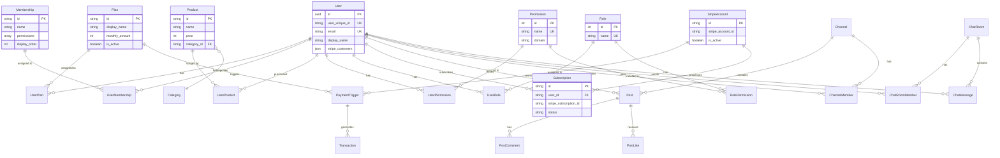

```mermaid
erDiagram
    %% ========== ユーザー関連 ==========
    User ||--o{ UserPlan : "has"
    User ||--o{ UserMembership : "has"
    User ||--o{ UserProduct : "purchased"
    User ||--o{ UserPermission : "has"
    User ||--o{ UserRole : "has"
    User ||--o{ Subscription : "subscribes"
    
    %% ========== プラン・メンバーシップ ==========
    Plan ||--o{ UserPlan : "assigned to"
    Plan ||--o{ PaymentTrigger : "triggers"
    Membership ||--o{ UserMembership : "assigned to"
    
    %% ========== 決済関連 ==========
    StripeAccount ||--o{ PaymentTrigger : "owns"
    StripeAccount ||--o{ Subscription : "processes"
    PaymentTrigger ||--o{ Transaction : "generates"
    
    %% ========== 商品 ==========
    Product ||--o{ UserProduct : "bought by"
    Product }o--|| Category : "belongs to"
    
    %% ========== 権限 ==========
    Role ||--o{ UserRole : "assigned to"
    Role ||--o{ RolePermission : "has"
    Permission ||--o{ UserPermission : "granted to"
    Permission ||--o{ RolePermission : "included in"
    
    %% ========== コミュニティ ==========
    User ||--o{ Post : "writes"
    Channel ||--o{ Post : "contains"
    Post ||--o{ PostComment : "has"
    Post ||--o{ PostLike : "receives"
    User ||--o{ ChannelMember : "joins"
    Channel ||--o{ ChannelMember : "has"
    
    %% ========== チャット ==========
    User ||--o{ ChatRoomMember : "joins"
    ChatRoom ||--o{ ChatRoomMember : "has"
    ChatRoom ||--o{ ChatMessage : "contains"
    User ||--o{ ChatMessage : "sends"

    %% ========== エンティティ定義 ==========
    User {
        uuid id PK
        string user_unique_id UK
        string email UK
        string display_name
        json stripe_customers
    }
    
    Plan {
        string id PK
        string display_name
        int monthly_amount
        boolean is_active
    }
    
    Membership {
        string id PK
        string name
        array permissions
        int display_order
    }
    
    Product {
        string id PK
        string name
        int price
        string category_id FK
    }
    
    Permission {
        int id PK
        string name UK
        string domain
    }
    
    Role {
        int id PK
        string name UK
    }
    
    StripeAccount {
        string id PK
        string stripe_account_id
        boolean is_active
    }
    
    Subscription {
        string id PK
        string user_id FK
        string stripe_subscription_id
        string status
    }
```
