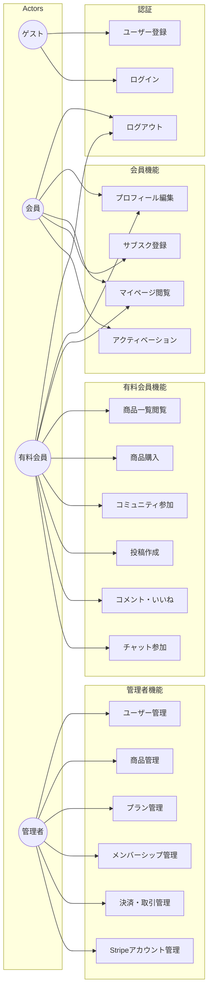

```mermaid
flowchart LR
    subgraph Actors
        Guest((ゲスト))
        Member((会員))
        Subscriber((有料会員))
        Admin((管理者))
    end

    subgraph 認証
        UC1[ユーザー登録]
        UC2[ログイン]
        UC3[ログアウト]
    end

    subgraph 会員機能
        UC4[プロフィール編集]
        UC5[マイページ閲覧]
        UC6[サブスク登録]
        UC7[アクティベーション]
    end

    subgraph 有料会員機能
        UC8[商品一覧閲覧]
        UC9[商品購入]
        UC10[コミュニティ参加]
        UC11[投稿作成]
        UC12[コメント・いいね]
        UC13[チャット参加]
    end

    subgraph 管理者機能
        UC14[ユーザー管理]
        UC15[商品管理]
        UC16[プラン管理]
        UC17[メンバーシップ管理]
        UC18[決済・取引管理]
        UC19[Stripeアカウント管理]
    end

    %% ゲストのユースケース
    Guest --> UC1
    Guest --> UC2

    %% 会員のユースケース
    Member --> UC3
    Member --> UC4
    Member --> UC5
    Member --> UC6
    Member --> UC7

    %% 有料会員のユースケース（会員機能も含む）
    Subscriber --> UC3
    Subscriber --> UC4
    Subscriber --> UC5
    Subscriber --> UC8
    Subscriber --> UC9
    Subscriber --> UC10
    Subscriber --> UC11
    Subscriber --> UC12
    Subscriber --> UC13

    %% 管理者のユースケース
    Admin --> UC14
    Admin --> UC15
    Admin --> UC16
    Admin --> UC17
    Admin --> UC18
    Admin --> UC19
```
